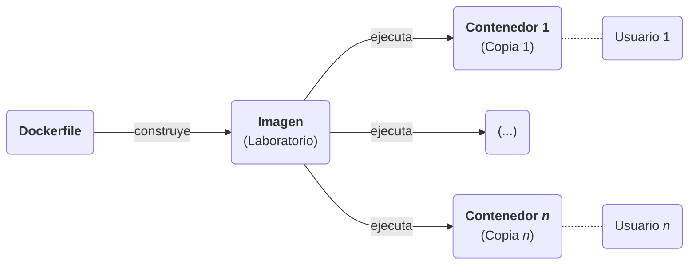

# Laboratorios para prácticas de Pentesting

Este repositorio contiene ficheros relacionados con el contenido de la plataforma web del mi proyecto de TFG:

**`/kali`**  
- Documentación sobre la creación de una máquina virtual de Kali Linux.
- Un script para construir una máquina virtual de Kali Linux usando Vagrant.

**`/labs`**  
- Documentación formativa sobre los conceptos de los laboratorios.
- Imágenes de Docker de los laboratorios en formato *Dockerfile*.
- Un script para construir todas las imágenes de los laboratorios.

> **Note**  
> El contenido del repositorio está pensado para su uso en un servidor, pero puede usarse de forma local si el usuario tiene Docker instalado en su equipo.
>
> También puede acceder al contenido formativo usando los ficheros Markdown de los laboratorios.


# Funcionamiento

Estos laboratorios son imágenes de Docker con las que poder levantar contenedores que permiten a un usuario realizar pruebas de penetración (*pentesting*) de forma segura y sin riesgo de dañar su propio equipo.



Cada laboratorio abarca un tema o concepto en específico, y su contenido (ficheros, paquetes, vulnerabilidades...) sigue un patrón de "el mínimo contenido posible para entender el concepto"; esto es así para que el usuario se centre sola y exclusivamente en el concepto a tratar.

Sin embargo, los conceptos no siempre podrán ser simples, pero la idea es tratar de dosificarlos lo máximo posible para que conceptos complejos resulten como combinaciones de experiencias pasadas más simples.


# Instalación

El repositorio contiene un fichero *instalación.sh* que lee todos los archivos *Dockerfile* de las carpetas y construye las imágenes correspondientes, actualizando las imágenes si ya existiteran en el sistema del usuario.

Las imágenes resultantes tienen **el mismo nombre** que sus carpetas contenedoras.


## Requisitos previos
- Shell y Bash deben estar instalados en el sistema para ejecutar los scripts de instalación.
- Docker y Docker Compose deben estar instalados en el sistema.
- Docker debe gestionar adecuadamente las credenciales del usuario de Docker Hub.

> **Warning**  
> Si existen fallos en las credenciales, los Dockerfile y los YAML no descargarán las imágenes base o en otras palabras, no harán `docker pull <imagen:versión>` de forma automática (aunque sí podrá hacerse de forma manual por el usuario).


## Máquina virtual de Kali Linux

Desplázate a la carpeta `/kali` y ejecuta el script de instalación `iniciar.sh`.

No olvides dar permisos de ejecución al script antes de ejecutarlo.

```shell
chmod +x iniciar.sh
```

Aquí se muestra un ejemplo de una instalación correcta:

```text
Instalando dependencias...
Paquetes instalados correctamente.
Ubicación del Vagrantfile: /home/srgalan/Vagrant/Kali
El directorio seleccionado no está vacío.
¿Sobreescribirlo? [s/n]: s
Reiniciciando el directorio '/home/srgalan/Vagrant/Kali'...
Directorio creado correctamente.
Creando la máquina virtual de Kali Linux...
Bringing machine 'default' up with 'virtualbox' provider...
==> default: Importing base box 'elrey741/kali-linux_amd64'...
==> default: Matching MAC address for NAT networking...
==> default: Checking if box 'elrey741/kali-linux_amd64' version '0.0.221' is up to date...
==> default: Setting the name of the VM: Kali_default_1689003159614_88917
==> default: Clearing any previously set network interfaces...
==> default: Preparing network interfaces based on configuration...
    default: Adapter 1: nat
==> default: Forwarding ports...
    default: 22 (guest) => 2222 (host) (adapter 1)
==> default: Running 'pre-boot' VM customizations...
==> default: Booting VM...
==> default: Waiting for machine to boot. This may take a few minutes...
    default: SSH address: 127.0.0.1:2222
    default: SSH username: vagrant
    default: SSH auth method: private key
```

> **Note**  
> Vagrant intentará conectarte usando SSH una vez la máquina virtual esté activa, pero fallará; lo seguirá intentando un tiempo, y finalmente el script terminará.
>
> Este funcionamiento es normal y no afecta al uso de la máquina virtual mediante VirtualBox, ni mediante SSH -pese a los mensajes de advertencia/error del script- usando el puerto 2222 mapeado en tu sistema (como indica el mensaje).


## Laboratorios

Desplázate a la carpeta `/labs` y ejecuta el script de instalación `instalación.sh`.

No olvides dar permisos de ejecución al script antes de ejecutarlo.

```shell
chmod +x instalación.sh
```

Aquí se muestra un ejemplo donde se instala 1 imagen nueva y se actualizan 2 anteriores.

```
Imagen: alpine-1-test
    Construyendo...
    Creada.

Imagen: alpine-2-test
    Duplicada.
    Actualizando...
    Actualizada.

Imagen: alpine-3-test
    Duplicada.
    Actualizando...
    Actualizada.

Resumen:
* alpine-1-test
* alpine-2-test
* alpine-3-test
```
