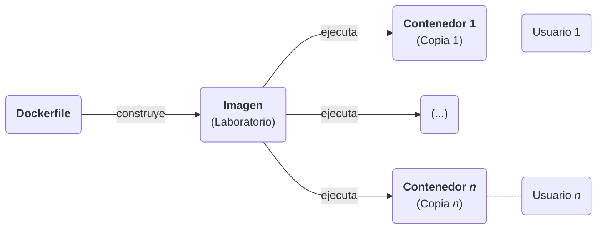

# Laboratorios para prácticas de Pentesting

Este repositorio contiene *Dockerfiles* que construyen laboratorios de pruebas para *pentesting*.

> **Note**  
> Está pensado para usarse en un servidor al que se conectaría un usuario, pero también puede ser usado en un equipo local ya que la única diferencia es **cómo** accede el usaario a un contenedor.

Estos laboratorios son imágenes de Docker con las que poder levantar contenedores que permiten a un usuario realizar pruebas de penetración (*pentesting*) de forma segura y sin riesgo de dañar su propio equipo.



Cada laboratorio abarca un tema o concepto en específico, y su contenido (ficheros, paquetes, vulnerabilidades...) sigue un patrón de "el mínimo contenido posible para entender el concepto"; esto es así para que el usuario se centre sola y exclusivamente en el concepto a tratar.

Sin embargo, los conceptos no siempre podrán ser simples, pero la idea es tratar de dosificarlos lo máximo posible para que conceptos complejos resulten como combinaciones de experiencias pasadas más simples.


# Instalación

El repositorio contiene un fichero *instalación.sh* que lee todos los archivos *Dockerfile* de las carpetas y construye las imágenes correspondientes, actualizando las imágenes si ya existiteran en el sistema del usuario.

Las imágenes resultantes tienen **el mismo nombre** que sus carpetas contenedoras.


## Requisitos previos
- Docker y Docker Compose deben estar instalados en el sistema.
- Docker debe gestionar adecuadamente las credenciales del usuario de Docker Hub.

> **Warning**  
> Si existen fallos en las credenciales, los Dockerfile y los YAML no descargarán las imágenes base o en otras palabras, no harán `docker pull <imagen:versión>` de forma automática (aunque sí podrá hacerse de forma manual por el usuario).


## Instalación
Otorgar permisos de ejecución al archivo.
```shell
chmod +x instalar.sh
```

Ejecutar el instalador.
```shell
./instalar.sh
```

## Ejemplo de salida
Aquí se muestra un ejemplo donde se instala 1 imagen nueva y se actualizan 2 anteriores.

```
Imagen: alpine-1-test
    Construyendo...
    Creada.

Imagen: alpine-2-test
    Duplicada.
    Actualizando...
    Actualizada.

Imagen: alpine-3-test
    Duplicada.
    Actualizando...
    Actualizada.

Resumen:
* alpine-1-test
* alpine-2-test
* alpine-3-test
```
