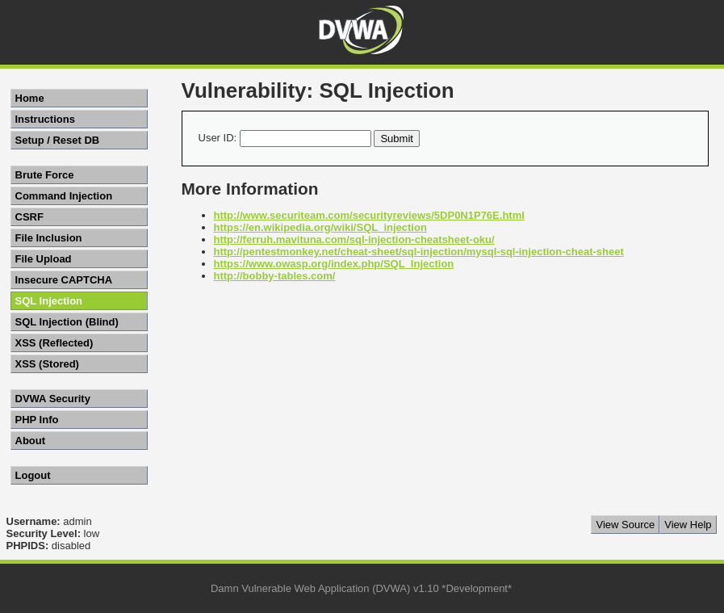
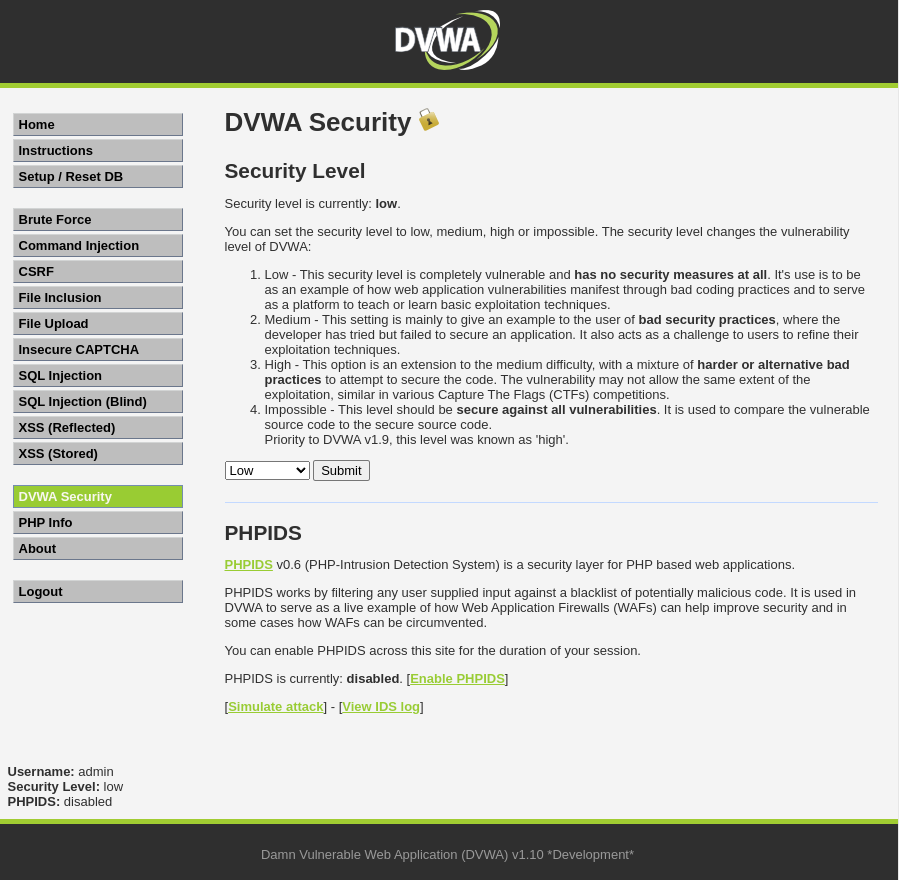
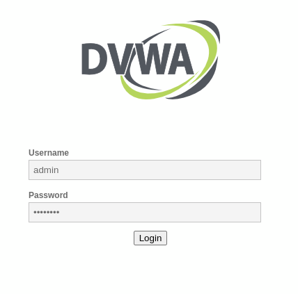
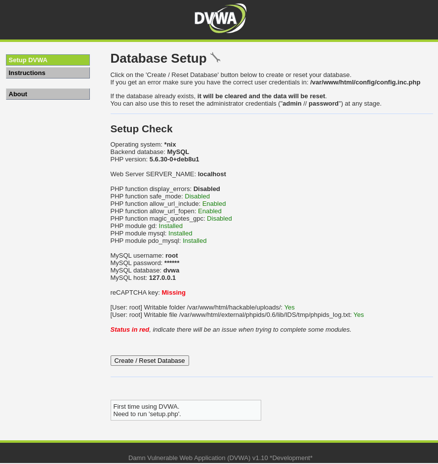

# Ataque de Inyección SQL

Un ataque de inyección SQL es un tipo de ataque de inyección de código que se dirige a las aplicaciones que utilizan bases de datos de tipo SQL; este ataque se realiza **introduciendo un código SQL malicioso en las declaraciones SQL de entrada de una aplicación web**.

Una inyección exitosa puede:

- Leer información confidencial de una base de datos.
- Modificar la información de una base de datos (insertar / actualizar / eliminar).
- Ejecutar operaciones administrativas en una base de datos (como apagar el DBMS).
- Recuperar el contenido del sistema de archivos, o incluso enviar comandos al sistema operativo.

> **Nota**  
> Un DBMS (*Database Management System*) es un sistema de gestión de bases de datos; es decir, un software que permite crear y administrar bases de datos.
>
> Ejemplos conocidos: MySQL, MariaDB, PostgreSQL, Microsoft SQL Server, Oracle Database, SQLite...

## Tipos de inyección SQL

Existen muchos tipos de inyección SQL, pero los más comunes son:

- **Basada en errores**: se basa en errores de sintaxis de SQL. El atacante introduce un código SQL malicioso que provoca un error de sintaxis en la consulta SQL; este error revela información sobre la estructura de la consulta SQL y, por lo tanto, sobre la estructura de la base de datos.
- **Basada en uniones**: se basa en la unión de tablas. El atacante introduce un código SQL malicioso con el que une a una tabla de la base de datos que no está destinada a la consulta SQL original; el resultado de la consulta SQL se combina con el resultado de la consulta SQL original y se devuelve al atacante.
- **Basada en tiempo**: se basa en el tiempo de respuesta de la consulta SQL. El atacante introduce un código SQL malicioso que provoca un retraso en la respuesta de la consulta SQL; el retraso revela información sobre la estructura de la consulta SQL y, por lo tanto, sobre la estructura de la base de datos.
- **Basada en booleanos**: se basa en el resultado de la consulta SQL. El atacante introduce un código SQL malicioso que provoca un resultado de consulta SQL verdadero o falso; el resultado revela información sobre la estructura de la consulta SQL y, por lo tanto, sobre la estructura de la base de datos.

## Ejemplo

Supongamos que tenemos una aplicación web que permite a los usuarios iniciar sesión con un nombre de usuario y una contraseña. La aplicación web utiliza una base de datos de tipo SQL para almacenar las credenciales de los usuarios.

La aplicación web utiliza la siguiente consulta SQL para verificar si el nombre de usuario y la contraseña proporcionados por el usuario son válidos:

```sql
SELECT * FROM users WHERE username = '<username>' AND password = '<password>'
```

- Si el nombre y contraseñas **son válidos**, se devuelve una fila d e`users`.
- Si el nombre y contraseñas **no son válidos**, no se devuelve ninguna fila.

Ahora, supongamos que el usuario introduce el siguiente nombre de usuario y contraseña:

- Usuario: `administrador`
- Contraseña: `contraseña' OR '1' = '1`

La aplicación web utiliza la siguiente consulta SQL para verificar si el nombre de usuario y la contraseña proporcionados por el usuario son válidos:

```sql
SELECT * FROM users WHERE username = 'administrador' AND password = 'contraseña' OR '1' = '1'
```

- Si el nombre y contraseñas **son válidos**, se devuelve una fila de `users`.
- Si el nombre y contraseñas **no son válidos**, no se devuelve ninguna fila.
- Si la expresión $1 = 1$ es **verdadera**, se devuelve una fila de `users`.

La consulta SQL devuelve una fila de la tabla `users`, por lo que la aplicación web permite al usuario iniciar sesión.

> **Nota**  
> El truco está en que la expresión $1 = 1$ siempre es cierta, por lo que al comprobar si *el usuario está registrado o $1 = 1$ es cierto*, **siempre se devuelve una fila de `users`** porque $1 = 1$ siempre es cierto.

El atacante ha utilizado una inyección SQL para engañar a la aplicación web y obtener acceso a la cuenta de administrador sin conocer la contraseña del administrador.

### Vulnerabilidad

La vulnerabilidad del ejemplo anterior se produce porque la aplicación web no valida los datos de entrada del usuario antes de utilizarlos en una consulta SQL, lo que le permite a un usuario introducir caracteres especiales que alteran el significado de la consulta SQL.

### Explotación

Esta es la consulta del ejemplo anterior:
 
```sql
SELECT * FROM users WHERE username = '<username>' AND password = '<password>'
```

Se necesita colocar una sentencia SQL entre el último carácter de `<password>` y la comilla `'` que *cierra* la contraseña.

La sentencia a colocar, para que encaje bien, debe empezar o contener una comilla `'` (para que *cierre* la contraseña) y terminar sin comilla `'` (porque se usará la que tenía la contraseña).

Por eso `contraseña' OR '1' = '1` encaja bien.


# Laboratorio

Este laboratorio contiene la web **DVWA**, usada para aprender sobre vulnerabilidades web. 

Si bien contiene vulnerabilidades de varios tipos, el objetivo de este apartado es la sección de Inyección SQL.

## Sobre DVWA

DVWA (*Damn Vulnerable Web App*) es una aplicación web PHP / MySQL de código abierto que es vulnerable de muchas formas. Su objetivo es ser un ejercicio de aprendizaje para ayudar a los desarrolladores web a probar vulnerabilidades con mayor facilidad.



Esta aplicación web cuenta con 4 niveles de dificultad: bajo, medio, difícil e imposible. El nivel de dificultad afecta a toda la página y por tanto, a todas las vulnerabilidades que contiene.

**Se ha configurado la aplicación para que se ejecute en *dificultad baja* por defecto**, aunque puede configurarse en la sección *DVWA Security* del menú izquierdo:



## Preparación

Credenciales del administrador:

- Usuario: `admin`.
- Contraseña: `password`.



Al acceder por primera vez a DVWA tendrás que inicializar su base de datos, para ello, simplemente:

1. Inicia sesión como administrador.
2. Pulsa el botón <kbd>Create / Reset Database</kbd>
3. Vuelve a iniciar sesión como administrador.



Una vez hecho eso, DVWA está activa y lista para usar.

> **Recuerda**  
> Tendrás que repetir estos simples pasos cada vez que inicies este laboratorio.


# Referencias


- [Repositorio ofiicial de DVWA](https://github.com/digininja/DVWA)
- [Inyección SQL en Wikipedia (EN)](https://en.wikipedia.org/wiki/SQL_injection)
