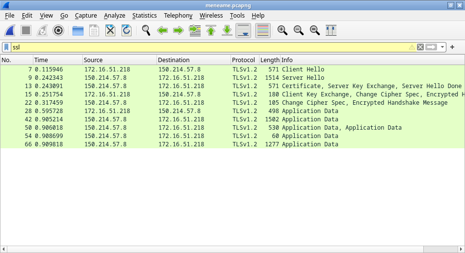
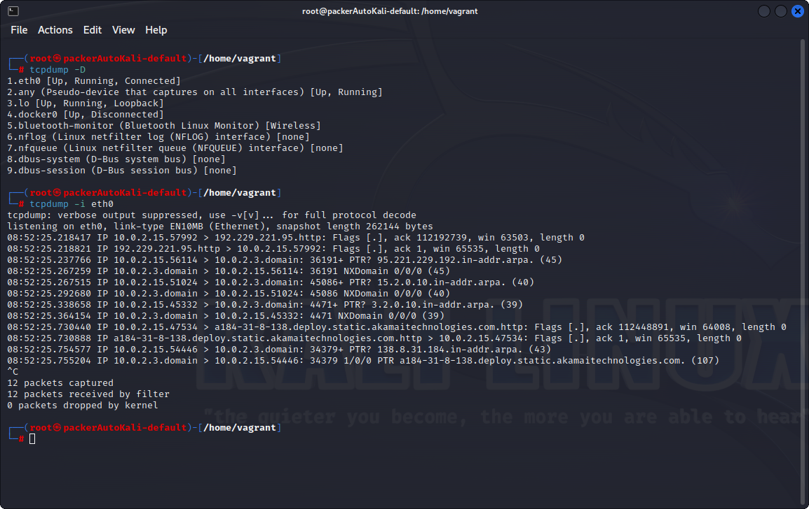
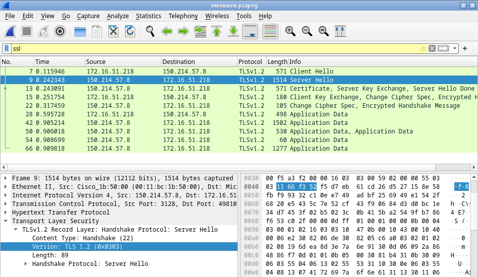
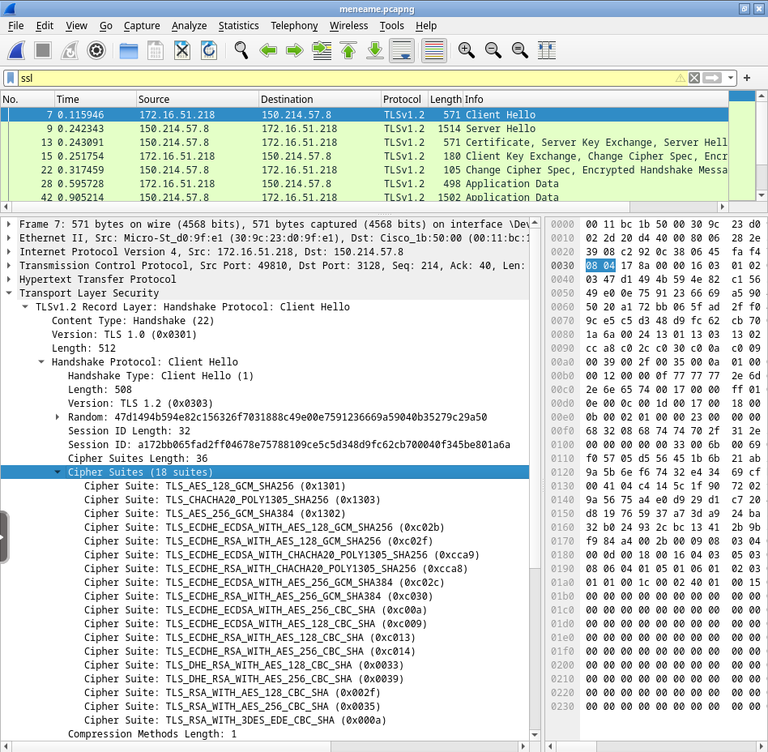
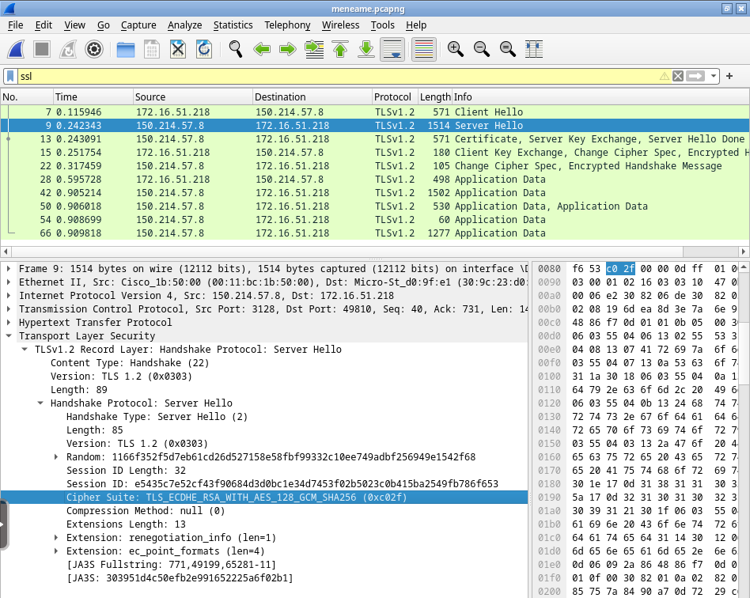
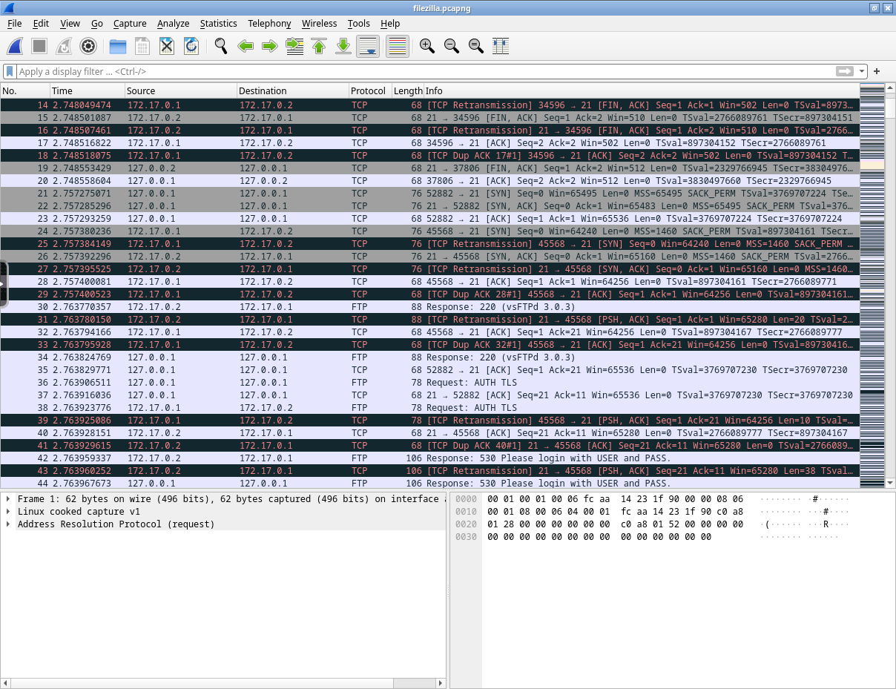
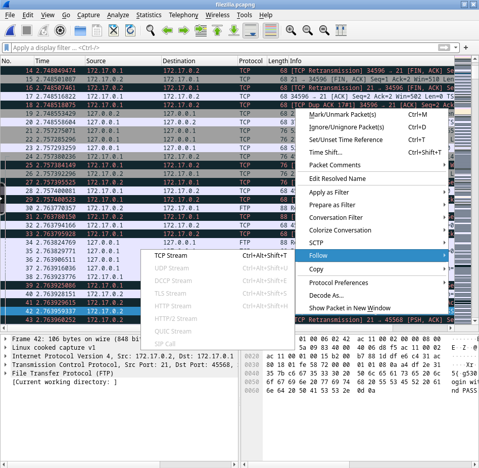
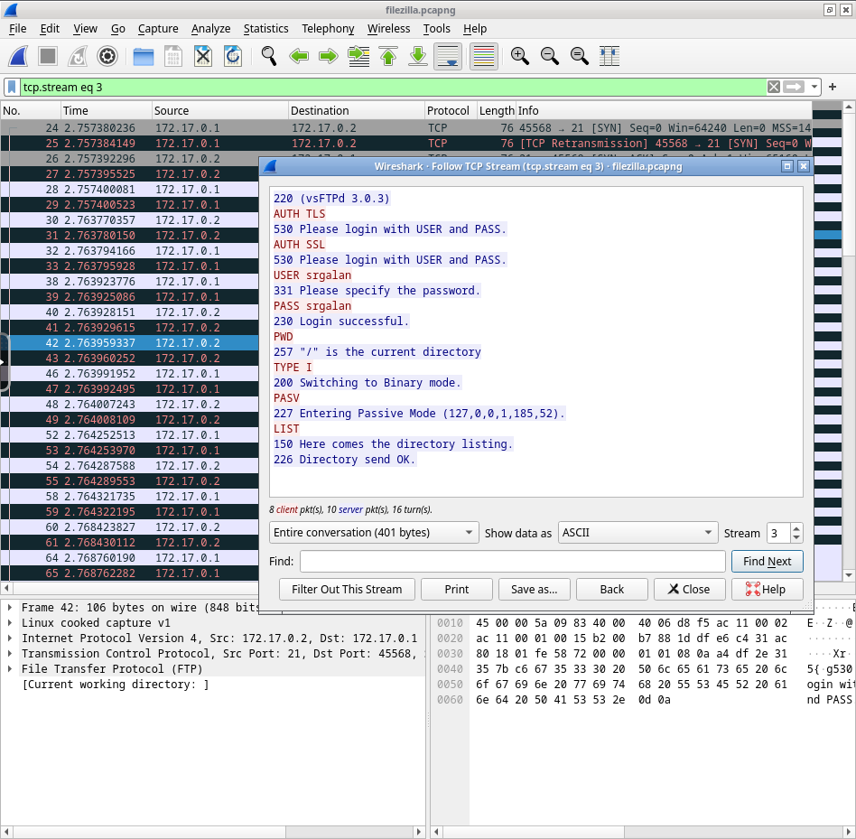
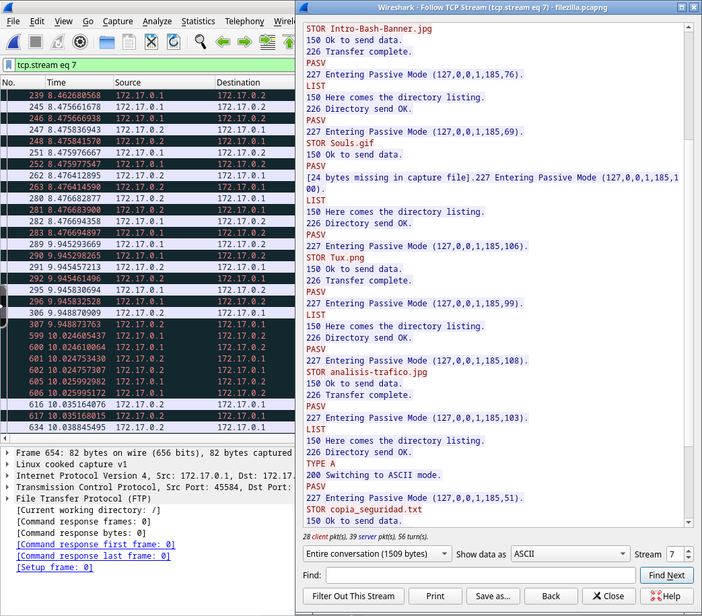
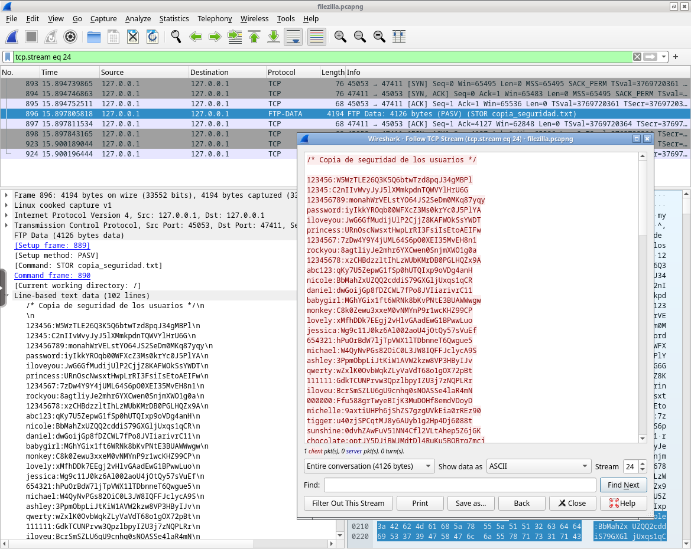

# Análisis de tráfico

Se trata del proceso que implica la captura, monitoreo y examen de los datos de los paquetes que fluyen a través de una red de dispositivos, cuyo objetivo principal es obtener información detallada sobre cómo se utiliza una red y qué ocurre en ella.

Esta información puede ser utilizada para diversos propósitos, como la resolución de problemas de rendimiento, la optimización de la red, la detección de intrusiones y la seguridad en general.

Los paquetes capturados se examinan y analizan en busca de información relevante, como: direcciones IP de origen y destino, protocolos utilizados, tipos de servicios, tamaños de paquetes, tiempos de respuesta, etc.

El análisis de tráfico ofrece varias ventajas:

- Ayudar a identificar cuellos de botella en la red.
- Detectar patrones de uso indebido o actividades maliciosas.
- Optimizar la configuración de la red para mejorar el rendimiento.
- Monitorear el cumplimiento de políticas de seguridad y calidad de servicio.
- (...)

También puede resultar útil para el diseño y dimensionamiento de redes, permitiendo tomar decisiones informadas basadas en el análisis de los flujos de tráfico existentes.

## ¿Qué es un paquete?

Un paquete es un pequeño bloque de información que contiene datos de la red, como la dirección IP de origen y destino, el protocolo utilizado, el puerto, etc., así como el contenido que se está enviando.

A continuación se muestran la estructura de los paquetes de los protocolos más comunes de Internet; pese a que tienen forma *cuadrada*, esto solo es una representación visual, ya que en realidad se trata de una secuencia de bits.

> **Nota**  
> Pese a llamarse *paquetes* y mostrarse como *cuadrados*, en realidad se trata de una secuencia de bits que se divide en campos de diferentes tamaños, y estos campos se muestran en forma de cuadrados para facilitar su visualización.

### TCP/IP

|           Campo           |  Bits   | Descripción                                                                                                                                                                                                                                            |
|:-------------------------:|:-------:|:------------------------------------------------------------------------------------------------------------------------------------------------------------------------------------------------------------------------------------------------------ |
|     Puerto de origen      |  0-15   | Puerto utilizado en el dispositivo que envía el paquete.                                                                                                                                                                                               |
|     Puerto de destino     |  16-31  | Puerto utilizado en el dispositivo que recibe el paquete.                                                                                                                                                                                              |
|    Número de secuencia    |  32-63  | Valor que identifica el orden de los paquetes TCP; se utiliza para asegurar que los paquetes se reciben y ensamblan en el orden correcto en el dispositivo de destino.                                                                                 |
| Número de acuse de recibo |  64-95  | Valor que se utiliza para confirmar la recepción de un paquete TCP. Cuando el dispositivo de destino recibe un paquete, envía un acuse de recibo al dispositivo de origen para indicar que el paquete se recibió correctamente.                        |
|   Longitud de cabecera    |  96-99  | Cantidad de bits que ocupa la cabecera del paquete; esta puede variar dependiendo de las opciones y los campos presentes en la cabecera.                                                                                                               |
|         Reservado         | 100-103 | El campo reservado para posibles implementaciones futuras en el protocolo TCP/IP; actualmente no se utilizan.                                                                                                                                          |
|           Flags           | 104-111 | Campos de control que indican diferentes estados y opciones en la comunicación TCP/IP: establecer la sincronización y finalización de una conexión TCP, para indicar la fragmentación de paquetes...                                                   |
|     Tamaño de ventana     | 112-127 | Cantidad de bits que el dispositivo de destino puede recibir antes de enviar un acuse de recibo de los paquetes recibidos; indica la capacidad del buffer de recepción en el dispositivo de destino.                                                   |
|         Checksum          | 128-159 | Código utilizado para verificar la integridad del paquete TCP/IP; se calcula en función de los datos y la cabecera del paquete y se utiliza en el dispositivo de destino para asegurarse de que los datos no se han corrompido durante la transmisión. |
|      Puntero urgente      | 160-175 | Indica que ciertos datos en el paquete TCP/IP son urgentes y deben ser tratados con prioridad en el dispositivo de destino. Este campo se usa en situaciones especiales.                                                                               |
|         Opciones          | 176-223 | Incluye información adicional en la cabecera del paquete TCP/IP; este puede contener diferentes parámetros y configuraciones específicas para la comunicación.                                                                                         |
|           Datos           |  224-   | Contenido del paquete que se está enviando (ficheros, mensajes, peticiones...) y que normalmente se trata de un fragmento del contenido total. Suele estar cifrado para proteger la información.                                                       |

### UDP

> **Nota**  
> Un *paquete UDP* también se conoce como *datagrama*.

|        Campo         |  Bits   | Descripción                                                                                                                                                                                                                                         |
|:--------------------:|:-------:|:--------------------------------------------------------------------------------------------------------------------------------------------------------------------------------------------------------------------------------------------------- |
|     IP de origen     |  0-31   | IP del dispositivo que envía el paquete.                                                                                                                                                                                                            |
|    IP de destino     |  32-63  | IP del dispositivo que debe recibir el paquete.                                                                                                                                                                                                     |
|        Ceros         |  64-79  | Los ceros son un campo reservado que se utiliza para posibles implementaciones futuras en el protocolo UDP. Actualmente no se utilizan y se reservan para uso futuro.                                                                               |
|      Protocolo       |  80-87  | Indica el protocolo de capa superior utilizado por el paquete UDP (DNS, DHCP, VoIP...).                                                                                                                                                             |
|     Longitud UDP     |  88-95  | Cantidad de bits que ocupa el paquete UDP en total, incluyendo la cabecera y los datos.                                                                                                                                                             |
|   Puerto de origen   | 96-111  | Puerto utilizado en el dispositivo que envía el paquete.                                                                                                                                                                                            |
|  Puerto de destino   | 112-127 | Puerto utilizado en el dispositivo que debe recibir el paquete.                                                                                                                                                                                     |
| Longitud del Mensaje | 128-143 | Cantidad de bits que contiene el mensaje en sí, excluyendo la cabecera UDP: en otras palabras, la longitud de los datos contenidos en el paquete UDP.                                                                                               |
|       Checksum       | 144-159 | Código utilizado para verificar la integridad del paquete UDP; se calcula en función de los datos y la cabecera del paquete y se utiliza en el dispositivo de destino para asegurarse de que los datos no se han corrompido durante la transmisión. |
|        Datos         |  160-   | Contenido del paquete TCP/IP que se está enviando (mensajes, consultas, respuestas...).                                                                                                                                                             |

### ICMP

|  Campo   | Bits  | Descripción                                                                                                                                                                                                                                                      |
|:--------:|:-----:|:---------------------------------------------------------------------------------------------------------------------------------------------------------------------------------------------------------------------------------------------------------------- |
|   Tipo   |  0-7  | Tipo de mensaje ICMP que se está transmitiendo: ICMP es un protocolo utilizado para controlar y administrar mensajes de error y de estado en las redes IP, por lo que este campo define el propósito y la función del mensaje ICMP (error, estado, consulta...). |
|  Código  | 8-15  | Información adicional sobre el mensaje ICMP. Junto con el campo de tipo, el campo de código ayuda a identificar y clasificar los mensajes ICMP en diferentes categorías y situaciones.                                                                           |
| Checksum | 16-31 | Código utilizado para verificar la integridad del paquete ICMP; se calcula en función de los datos y la cabecera del paquete y se utiliza en el dispositivo de destino para asegurarse de que los datos no se han corrompido durante la transmisión.             |
|  Datos   |  32-  | Contenido del paquete ICMP que se está enviando; pueden contener información relacionada con el mensaje de error o el mensaje de estado específico transmitido a través del protocolo ICMP. Los datos pueden variar según el tipo y el código del mensaje ICMP.  |

#### Tipos de mensajes ICMP

Estas son las posibles combinaciones de mensajes en función de su tipo y código:

<table>
    <thead>
        <tr>
            <th>Tipo</th>
            <th>Código</th>
            <th>Descripción</th>
        </tr>
    </thead>
    <tbody>
        <tr>
            <td rowspan="1">0</td>
            <td>0</td>
            <td>Respuesta de eco (`ping`)</td>
        </tr>
        <tr>
            <td rowspan="16">3</td>
            <td>0</td>
            <td>Red inaccesible</td>
        </tr>
        <tr>
            <td>1</td>
            <td>Host inaccesible</td>
        </tr>
        <tr>
            <td>2</td>
            <td>Protocolo inaccesible</td>
        </tr>
        <tr>
            <td>3</td>
            <td>Puerto inaccesible</td>
        </tr>
        <tr>
            <td>4</td>
            <td>Fragmentación necesaria y no realizada</td>
        </tr>
        <tr>
            <td>5</td>
            <td>Fuente de ruta fallida</td>
        </tr>
        <tr>
            <td>6</td>
            <td>Red de destino desconocida</td>
        </tr>
        <tr>
            <td>7</td>
            <td>Host de destino desconocido</td>
        </tr>
        <tr>
            <td>8</td>
            <td>Host de origen aislado</td>
        </tr>
        <tr>
            <td>9</td>
            <td>Comunicación con la red de destino prohibida por tipo de servicio</td>
        </tr>
        <tr>
            <td>10</td>
            <td>Comunicación con el host de destino prohibida por tipo de servicio</td>
        </tr>
        <tr>
            <td>11</td>
            <td>Red inaccesible por administración</td>
        </tr>
        <tr>
            <td>12</td>
            <td>Host inaccesible por administración</td>
        </tr>
        <tr>
            <td>13</td>
            <td>Comunicación con la red de destino prohibida por tipo de servicio</td>
        </tr>
        <tr>
            <td>14</td>
            <td>Comunicación con el host de destino prohibida por tipo de servicio</td>
        </tr>
        <tr>
            <td>15</td>
            <td>Comunicación prohibida por administración</td>
        </tr>
        <tr>
            <td>4</td>
            <td>0</td>
            <td>Red desconocida</td>
        </tr>
        <tr>
            <td rowspan="4">5</td>
            <td>0</td>
            <td>Redirección de la red</td>
        </tr>
        <tr>
            <td>1</td>
            <td>Redirección para el host</td>
        </tr>
        <tr>
            <td>2</td>
            <td>Redirección para el tipo de servicio y red</td>
        </tr>
        <tr>
            <td>3</td>
            <td>Redirección para el tipo de servicio y host</td>
        </tr>
        <tr>
            <td>8</td>
            <td>0</td>
            <td>Solicitud de eco (`ping`)</td>
        </tr>
        <tr>
            <td rowspan="2">11</td>
            <td>0</td>
            <td>Tiempo excedido para un datagrama</td>
        </tr>
        <tr>
            <td>1</td>
            <td>Tiempo excedido para un fragmento reensamblado</td>
        </tr>
        <tr>
            <td>13</td>
            <td>0</td>
            <td>Solicitud de marca de tiempo</td>
        </tr>
        <tr>
            <td>14</td>
            <td>0</td>
            <td>Respuesta de marca de tiempo</td>
        </tr>
        <tr>
            <td>17</td>
            <td>0</td>
            <td>Solicitud de dirección de máscara</td>
        </tr>
        <tr>
            <td>18</td>
            <td>0</td>
            <td>Respuesta de dirección de máscara</td>
        </tr>
    </tbody>
</table>

### ARP

|      Campo      |  Bits   | Descripción                                                                                            |
|:---------------:|:-------:|:------------------------------------------------------------------------------------------------------ |
|      HTYPE      |  0-15   | Indica el tipo de hardware utilizado en la red, como Ethernet, Token Ring, etc.                        |
|      PTYPE      |  16-31  | Especifica el tipo de protocolo de red utilizado, generalmente IPv4 (0x0800) o IPv6 (0x86DD).          |
|      HLEN       |  32-39  | Indica la longitud en bytes de la dirección de hardware (dirección MAC).                               |
|      PLEN       |  40-47  | Especifica la longitud en bytes de la dirección de protocolo (dirección IP).                           |
|    Operación    |  48-63  | Código que define la operación que se realizará, como solicitud (*request*) o respuesta (*reply*).     |
|  MAC de origen  | 64-111  | MAC del dispositivo que envía el paquete.                                                              |
|  IP de origen   | 112-143 | IP del dispositivo que envía del paquete.                                                              |
| MAC de destino  | 144-191 | MAC del dispositivo que debe recibir el paquete.                                                       |
|  IP de destino  | 192-223 | IP del dispositivo que debe recibir el paquete.                                                        |
| Datos (relleno) |  224-   | Campo opcional utilizado para asegurar que el tamaño total del paquete ARP sea un múltiplo de 32 bits. |

## ¿Cómo se realiza el análisis de tráfico?

No existe una *forma correcta* y secuencial de hacer un análisis, ya que depende de los objetivos y el contexto del mismo, además del flujo de trabajo que haya interiorizado cada pentester, su forma de trabajar y su experiencia.

Sin embargo, en términos generales, el análisis de tráfico se puede realizar de forma manual o automática, y se puede realizar en tiempo real o en diferido.

### Análisis manual

Este tipo de análisis se lleva a cabo cuando se quiere analizar un paquete o conversación en concreto, ya que es más rápido y sencillo que el análisis automático; sin embargo, requiere de una mayor precisión e investigación previa para saber qué paquetes analizar.

El proceso de análisis de un paquete consisistirá en extraer todos los datos de los campos del mismo y así componer una información más detallada, esto se puede lograr con las herramientas mencionadas en la siguiente sección.

### Análisis automático

Este tipo de análisis se lleva a cabo cuando se quiere analizar un gran número de paquetes o conversaciones, ya que realizarlo de forma manual sería muy lento y tedioso; no obstante, no se obtiene la misma precisión que con el análisis manual y la información obtenida es más genérica y superficial.

Este análisis se lleva a cabo de forma automática por las herramientas y servicios que se utilizan para ello.

# Herramientas comunes

Existen diversas herramientas y técnicas para llevar a cabo el análisis de tráfico de red; algunas de las herramientas más populares incluyen Wireshark, tcpdump, Snort y ntop.

Estas herramientas permiten capturar y analizar los paquetes de datos en tiempo real, proporcionando información valiosa sobre el tráfico de red.

## Wireshark

Herramienta de análisis de tráfico de red de código abierto que permite capturar y examinar paquetes de datos en tiempo real.

Algunas características de Wireshark incluyen:

- **Captura de paquetes:** Wireshark puede interceptar y analizar los paquetes de datos que fluyen a través de una red.

- **Análisis detallado:** proporciona información completa sobre los paquetes capturados, incluyendo direcciones IP de origen y destino, protocolos utilizados, tamaños de paquetes, tiempos de respuesta, entre otros (en función del tipo de paquete).

- **Filtrado de paquetes:** permite aplicar filtros para visualizar únicamente los paquetes relevantes para un análisis específico.

- **Interfaz gráfica de usuario:** Wireshark tiene una interfaz visual intuitiva que facilita la visualización y el análisis de los datos de tráfico.

- **Generación de capturas**: permite grabar tráfico de red, de forma que pueda extraerse en un fichero y poder analizarlo posteriormente o compartirlo.

## tcpdump

Herramienta de línea de comandos para el análisis de tráfico de red que proporciona capacidades de captura y análisis de paquetes similar a Wireshark.

Algunas características destacadas de tcpdump son:

- **Captura de paquetes:** tcpdump puede capturar y mostrar paquetes en tiempo real, lo que permite examinar el tráfico de red. Sin embargo, al ser una herramienta de línea de comandos, la salida mostrada puede ser muy compleja y difícil de analizar.

- **Filtrado flexible:** permite aplicar filtros personalizados para capturar y mostrar solo los paquetes deseados, lo que facilita el análisis específico.

- **Compatibilidad con diversos protocolos:** tcpdump es compatible con una amplia gama de protocolos de red, lo que permite analizar diferentes tipos de tráfico.

## Snort

Snort es un sistema de detección y prevención de intrusiones basado en reglas que se utiliza para monitorear y analizar el tráfico de red en busca de patrones o comportamientos maliciosos.

Las principales características de Snort incluyen:

- **Detección de intrusiones:** Snort utiliza reglas predefinidas para identificar patrones y comportamientos de tráfico sospechosos, lo que ayuda a detectar posibles ataques o intrusiones en la red.

- **Registro de eventos:** registra eventos de seguridad relevantes y genera alertas cuando se detecta actividad sospechosa.

- **Análisis de tráfico en tiempo real:** Snort puede analizar el tráfico en tiempo real y tomar medidas preventivas en caso de detectar actividades maliciosas.

## ntop

ntop es una herramienta de monitoreo de red que proporciona una visión detallada del tráfico en tiempo real.

Algunas características de ntop son:

- **Monitoreo en tiempo real:** ntop muestra información actualizada sobre el tráfico de red en tiempo real, incluyendo estadísticas de uso, flujos de datos y conexiones.

- **Estadísticas detalladas:** proporciona información detallada sobre protocolos utilizados, direcciones IP, puertos, tamaños de paquetes, entre otros datos.

- **Interfaz gráfica de usuario:** ntop tiene una interfaz visual intuitiva que facilita la visualización y el análisis de los datos de tráfico.

# Laboratorio

> **Nota**  
> Este laboratorio debe usarse **directamente en el navegador** colocando la dirección y el puerto del mismo en la barra de direcciones.

Este entorno contiene distintas capturas de tráfico realizadas con Wireshark en la carpeta `/config/capturas`, y donde podrás usar Wireshark de forma interactiva para analizar dicho tráfico.

En su conjunto, podrás obtener información como: credenciales FTP de un usuario, los campos de los paquetes de comunicaciones TCP, así como una visión del funcionamiento del protocolo ARP, entre otros.

Por otra parte, también se mostrarán ejemplos de análisis de las capturas SSL.pcap y filezilla.pcap, para mostrar un proceso básico de análisis de tráfico y obtención de información en una comunicación cifrada y sin cifrar, respectivamente.

## Traza *SSL*

> **Nota**  
> Para empezar, pulsa en la pestaña superior izquierda `File > Open` y selecciona la captura `SSL.pcap` para cargarla en Wireshark.

Como podrás observar, la captura contiene más tráfico del necesario, por lo que sería interesante aplicar un filtro para visualizar únicamente los paquetes relevantes.

Aquí se están buscando paquetes pertenecientes a una conversación SSL, por lo que se puede aplicar el filtro `ssl`.

SSL es un protocolo de seguridad que se utiliza para cifrar las comunicaciones entre un cliente y un servidor, de forma que los datos transmitidos no puedan ser interceptados por terceros; TLS por el contrario, no es más que una versión mejorada de SSL.

> **Nota**  
> Este es el motivo por el que el filtro `ssl` también funciona para TLS.

Comenzando por el principio, antes de establecerse la conexión, el cliente y el servidor deben intercambiar información sobre los protocolos y cifrados que soportan, así como otros parámetros necesarios para establecer la conexión.

Este proceso previo de negociación de la conexión se conoce como *handshake*, y puede observarse cómo tiene lugar entre las tramas 7 y 22. Esto es así porque son los únicos paquetes que no están intercambiando datos (​*Application Data​*), sino información sobre la conexión.

> **Nota**  
> Observa qué información manejan los otros paquetes: *Certificate*, *Exchange*, *Encrypted Handshake Message*, etc.

Abriendo la información sobre la seguridad en la capa de transporte, se puede observar que se está usando la versión 1.2 de TLS. Sin embargo, la conexión se inicializa con TLS 1.0 (trama 7), pero en la respuesta del servidor (trama 9) se indica que puede utilizarse la versión 1.2 y, finalmente, esta última versión es la que se utiliza para la comunicacicón (a partir de la trama 10).

Al abrir la trama 7 (*Client Hello*), se puede observar los tipos de cifrados que soporta el cliente; estos datos se muestran en la sección *Cipher Suites* y son interesantes para determinar la seguridad de la conexión.

Para saber qué suite de cifrado se establece para la conexión, basta con visitar de nuevo la respuesta del servidor (trama 9), donde es el servidor el que le responde al cliente qué suite de cifrado se va a utilizar.

El servidor establece que se use la suite `TLS_ECDHE_RSA_WITH_AES_128_GCM_SHA256 (0xc02f)`, por lo que la comunicación futura se cifrará usando: el algoritmo AES, en modo GCM (Galois/Counter Mode), con una clave de 128 bits.

## Traza *filezilla*

> **Nota**  
> Para empezar, pulsa en la pestaña superior izquierda `File > Open` y selecciona la captura `filezilla.pcap` para cargarla en Wireshark.

Al contrario que en la captura anterior, aquí se muestra el uso de Filezilla por parte de un cliente para conectarse a un servidor FTP.

La desventaja de FTP es que no cifra las comunicaciones, por lo que es posible interceptar los datos que se transmiten entre el cliente y el servidor.

Al abrir la captura se puede observar que hay un montón de paquetes de distintos tipos, pero bajando un poco ya se puede ver un paquete FTP (trama 42) que indica que se debe proceder con usuario y contraseña para autenticarse.

Como FTP no está cifrado, podemos ver el contenido de esos paquetes; pero en lugar de abrirlos uno por uno como sucedió en el ejemplo anterior, puedes usar la opción *Follow*, que te permite abrir el flujo de datos de la comunicación a la que pertenece el paquete.

Esta opción aparece haciendo click derecho sobre el paquete y seleccionando *Follow > TCP Stream*.

> **Nota**  
> Se quiere seguir el flujo TCP y no *el flujo FTP* porque:
> - FTP se usa en la capa de aplicación; se encarga de definir cómo y qué datos se envían.
> - TCP se usa en la capa de red; se encarga de definir cómo se envían los paquetes con dicha información.
>
> Si lo llevamos al terreno de los envíos a domicilio, FTP sería el encargado de seleccionar las cajas correctas, mientras que TCP sería el encargado de almacenarlas en el camión y llevarlo a su destino.

Y al abrir el flujo TCP, así como si nada, ya se obtienen las credenciales del usuario.

Investigando un poco más filtrando los paquetes por `ftp` o `ftp-data` (FTP cuando envía datos), se pueden observar los distintos comandos FTP enviados al servidor, como:

- `LIST`, para listar los archivos del directorio actual.
- `RETR`, para descargar un archivo.
- `STOR`, para subir un archivo.

Y repitiendo el mismo proceso con *Follow*, además, se puede ver el nombre de los propios ficheros enviados.

> **Nota**  
> También es posible navegar entre los distintos flujos usando el apartado *Stream* en la parte inferior derecha de la ventana de *Follow*.
>
> Esto permite una navegación más cómoda, pero si no se sabe qué se está buscando o el tamaño de la captura es muy grande, puede llegar a ser contraproducente.

Por último, sabiendo qué ficheros ha almacenado o descargado el usuario, se puede buscar en la captura el contenido de dichos ficheros.

Una opción posible sería filtrar por `ftp-data.command-frame` para obtener los paquetes en los que se usan comandos FTP, y ahí buscar los comandos `RETR` y `STOR` para obtener los paquetes que contienen los ficheros. Una vez encontrado el archivo deseado, se puede usar *Follow* para abrir el flujo TCP y ver el contenido del fichero en texto plano.

> **Nota**  
> Los archivos multimedia, como es de esperar, tendrán una representación extraña en texto plano (porque no son texto), pero se pueden identificar algunos campos a simple vista, como el tipo de archivo multimedia.

Una trama interesante es la número 896, donde se está realizando el envío de un fichero de copias de seguridad de los usuarios de algún sistema, y donde pueden verse los nombres de los usuarios y sus contraseñas en texto plano.

Las contraseñas del fichero tienen un aspecto raro, por lo que es posible que estén cifradas, pero se ha podido lelgar a esta información gracias al análisis del tráfico y ahora se podría intentar descifrarlas por otros medios.

# Referencias

- [WireShark](https://www.wireshark.org) - Página oficial de Wireshark
- [javapoint](https://www.javatpoint.com/wireshark) - Tutorial de Wireshark
- [tcpdump](https://www.tcpdump.org) - Página oficial de tcpdump
- [Snort](https://www.snort.org) - Página oficial de Snort
- [ntop](https://www.ntop.org)  - Página oficial de ntop

