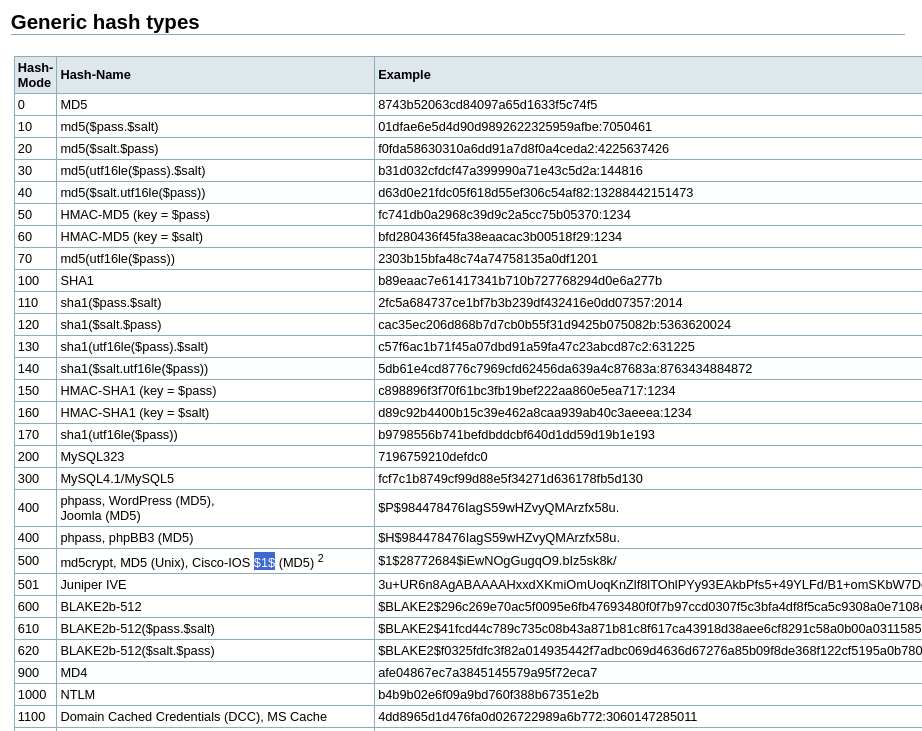

<!-- Escalada de Privilegios -->

# Introducción

Se conoce como escalada de privilegios al proceso de obtener privilegios de administrador en un sistema, cuando se tiene acceso a un usuario con privilegios limitados.

El concepto en sí puede resultar algo abstracto, ya que no es un concepto tan puntual como "fuerza bruta" o "cifrado", sino que es un concepto más general y que abarca muchas técnicas distintas.


# Casos de uso

La esencia de la escalada de privilegios es la capacidad de identificar distintas "rutas" o posibilidades para obtener privilegios de administrador, y luego poder explotarlas.

Se muestran a continuación algunas de las situaciones más comunes en las que se puede aplicar la escalada de privilegios:

## Explotación del Kernel

El kernel es el núcleo del sistema operativo, y es el encargado de administrar los recursos del sistema y de proveer una interfaz para que los programas puedan interactuar con el hardware.

El kernel es un programa como cualquier otro, y por lo tanto, puede tener vulnerabilidades que permitan obtener privilegios de administrador.

Por ejemplo, si un programa tiene un bug que permite que un usuario pueda escribir en una dirección de memoria que no le corresponde, podría sobreescribir la dirección de retorno de una función del kernel, y así lograr que el kernel ejecute código arbitrario.

## Permisos de ficheros

Los permisos se organizan en función del dueño del fichero, del grupo al que pertenece el mismo y de los demás usuarios, y se dividen en tres categorías: lectura, escritura y ejecución.

Si estos permisos estuvieran mal configurados para un fichero, sobre todo si es ejecutable, un usuario con permisos de escritura podría modificarlo para que ejecutara código arbitrario o incluso, si este tiene permisos de escritura, podría modificarlo para que se ejecute con privilegios de administrador.

## Servicios

Los servicios también siguen una política de permisos, y si estos están mal configurados, un usuario podría modificarlos para que se lleguen a ejecutar con privilegios de administrador.

Por ejemplo, si un servicio tiene un fichero de configuración que permite que un usuario pueda modificar el comando que se ejecuta, podría modificarlo para que se ejecute con privilegios de administrador.

## SUID

El bit SUID es un bit que se puede aplicar a un fichero, y que permite que cuando un usuario lo ejecute, se ejecute con los permisos del dueño del fichero, en lugar de los del usuario que lo ejecuta.

Esto tiene sentido para ficheros que necesitan permisos de administrador para ejecutarse, pero que no se quiere que cualquier usuario pueda ejecutarlos con privilegios de administrador; y por otro lado, también resulta un punto de inflexión para la escalada de privilegios, ya que si un usuario puede acceder a un fichero con el bit SUID activado, podría ejecutarlo directamente como un administrador.


# Laboratorio

> **Credenciales**  
> - `user:user`.

Este entorno contiene una vulnerabilidad de permisos débiles en un archivo muy importante: `/etc/shadow`, y una lista de contraseñas en `/home/user/rockyou-top15k.txt`.

Antiguamente, las contraseñas se almacenaban en el fichero `/etc/passwd`, pero actualmente se almacenan en el fichero `/etc/shadow`, un fichero que solo puede ser leído por el usuario `root`.

Por supuesto, las contraseñas están almacenadas siguiendo un algoritmo de hash, por lo que no se pueden obtener directamente, pero si se puede obtener el hash de la contraseña, y luego intentar romperlo con un ataque de fuerza bruta.

Sabiendo esta información sobre el sistema, se puede intentar obtener el hash de la contraseña del usuario `root`, y luego intentar romperlo con un ataque de fuerza bruta.

Para ello, observa los permisos que existen en el contenido de `/etc`:

```bash
(...)

-rw-r--r-- 1 root root     552 Jan 30  2021 pam.conf
drwxr-xr-x 1 root root    4096 Aug 17 17:34 pam.d
-rw-r--r-- 1 root root    1317 Aug 17 17:34 passwd
-rw-r--r-- 1 root root    1314 Aug 17 17:34 passwd-
-rw-r--r-- 1 root root     769 Apr 10  2021 profile
drwxr-xr-x 2 root root    4096 Apr  2 11:55 profile.d
drwxr-xr-x 2 root root    4096 Aug 16 15:45 python3
drwxr-xr-x 2 root root    4096 Aug 16 15:45 python3.9
drwxr-xr-x 2 root root    4096 Aug 14 00:00 rc0.d
drwxr-xr-x 2 root root    4096 Dec 14  2020 rc1.d
drwxr-xr-x 1 root root    4096 Aug 16 15:45 rc2.d
drwxr-xr-x 1 root root    4096 Aug 16 15:45 rc3.d
drwxr-xr-x 1 root root    4096 Aug 16 15:45 rc4.d
drwxr-xr-x 1 root root    4096 Aug 16 15:45 rc5.d
drwxr-xr-x 2 root root    4096 Aug 14 00:00 rc6.d
drwxr-xr-x 1 root root    4096 Aug 16 15:44 rcS.d
-rw-r--r-- 1 root root     613 Aug 18 10:56 resolv.conf
lrwxrwxrwx 1 root root      13 Feb 17  2021 rmt -> /usr/sbin/rmt
drwxr-xr-x 3 root root    4096 Aug 16 15:44 runit
drwxr-xr-x 4 root root    4096 Aug 14 00:00 security
drwxr-xr-x 2 root root    4096 Aug 14 00:00 selinux
-rw-r--r-- 1 root shadow   763 Aug 17 17:58 shadow
-rw-r----- 1 root shadow   697 Aug 17 17:34 shadow-
-rw-r--r-- 1 root root      73 Aug 14 00:00 shells
drwxr-xr-x 2 root root    4096 Aug 14 00:00 skel
drwxr-xr-x 1 root root    4096 Aug 17 17:58 ssh
drwxr-xr-x 4 root root    4096 Aug 16 15:45 ssl
-rw-r--r-- 1 root root      18 Aug 17 17:34 subgid
-rw-r--r-- 1 root root       0 Aug 14 00:00 subgid-
-rw-r--r-- 1 root root      18 Aug 17 17:34 subuid
-rw-r--r-- 1 root root       0 Aug 14 00:00 subuid-
-rw-r--r-- 1 root root    3975 Jan 14  2023 sudo.conf
-rw-r--r-- 1 root root    6169 Jan 14  2023 sudo_logsrvd.conf
-r--r----- 1 root root     669 Jan 14  2023 sudoers
drwxr-xr-x 2 root root    4096 Aug 16 15:44 sudoers.d
drwxr-xr-x 3 root root    4096 Aug 16 15:44 sv
-rw-r--r-- 1 root root    2355 Apr  6  2021 sysctl.conf
drwxr-xr-x 2 root root    4096 Aug 16 15:44 sysctl.d
drwxr-xr-x 1 root root    4096 Aug 16 15:44 systemd
drwxr-xr-x 2 root root    4096 Aug 14 00:00 terminfo
-rw-r--r-- 1 root root       8 Aug 14 00:00 timezone
drwxr-xr-x 2 root root    4096 Jun 18 14:55 tmpfiles.d
-rw-r--r-- 1 root root    1260 Jun 16  2020 ucf.conf
drwxr-xr-x 3 root root    4096 Aug 16 15:44 ufw
drwxr-xr-x 2 root root    4096 Aug 14 00:00 update-motd.d
drwxr-xr-x 2 root root    4096 Aug 16 15:44 vim
-rw-r--r-- 1 root root     642 Dec 24  2020 xattr.conf
drwxr-xr-x 3 root root    4096 Aug 16 15:44 xdg
```

La mayoría de los ficheros y directorios pueden ser leídos por los usuarios y algunos de ellos hasta pueden ser ejecutados, pero no se puede escribir en ninguno de ellos; y esto tiene sentido, ya que un usuario normal no debería poder escribir y modificar la configuración del sistema, mientras que algunos componentes sí que deberían poder ejecutarse para poder usar los programas.

Observando de nuevo la lista anterior, se puede ver que el fichero `/etc/shadow` tiene permisos de lectura para todos los usuarios, una vulnerabilidad grave teniendo en cuenta la descripción anterior; como se quiere elevar privilegios, se puede intentar obtener la contraseña del usuario `root` para poder iniciar sesión como él.

Revisando el contenido del fichero, se puede obtener una línea similar a esta:

```text
root:$1$V3k7V9sY$8LnDZKFDxSJ8jqUE6Wtzc/:19586:0:99999:7:::
```

El contenido de `/etc/shadow` es muy similar al de `/etc/passwd`; sin embargo, este último tiene oculta la contraseña colocando una `x` en su lugar, por eso `/etc/passwd` se puede leer por todos los usuarios, mientras que `/etc/shadow` no.

El contenido de `/etc/shadow` tiene el siguiente formato:

|       Campo       | Descripción                                                                           |                Valor                 |
|:-----------------:|:------------------------------------------------------------------------------------- |:------------------------------------:|
|    **Usuario**    | Nombre de usuario                                                                     |                `root`                |
|  **Contraseña**   | Contraseña (hash) del usuario                                                         | `$1$V3k7V9sY$8LnDZKFDxSJ8jqUE6Wtzc/` |
| **Último cambio** | Días transcurridos desde el último cambio de contraseña                               |               `19586`                |
|    **Mínimo**     | Mínimo de días antes de cambiar la contraseña                                         |                 `0`                  |
|    **Máximo**     | Máximo de días antes de cambiar la contraseña (caducidad, en días)                    |               `99999`                |
|  **Advertencia**  | Número de días antes de que caduque la contraseña para advertir al usuario            |                 `7`                  |
|  **Inactividad**  | Número de días después de que caduque la contraseña antes de que la cuenta se bloquee |               Ninguno                |
|  **Expiración**   | Fecha de expiración de la cuenta (en días desde el 1 de enero de 1970)                |               NInguno                |
|   **Reservado**   | Campo reservado para un uso futuro; no se usa actualmente                             |               Ninguno                |

Sabiendo eso, se ha obtenido el hash de la contraseña del usuario `root`, por lo que se puede usar una herramienta como *hashcat* para intentar crackearla.

No obstante, primero será necesario obtener el tipo de hash que se está usando, ya que *hashcat* necesita saberlo para poder crackearlo, y aunque hay varios métodos, como usar *hashid* o *john*, se puede usar la página web [Hashes.com](https://hashes.com/en/tools/hash_identifier) para identificar el tipo de hash.

```shell
hashid '$1$V3k7V9sY$8LnDZKFDxSJ8jqUE6Wtzc/'
```

```text
Analyzing '$1$V3k7V9sY$8LnDZKFDxSJ8jqUE6Wtzc/'
[+] MD5 Crypt [Hashcat Mode: 500]
[+] Cisco-IOS(MD5) [Hashcat Mode: 500]
[+] FreeBSD MD5 [Hashcat Mode: 500]
```

> **Nota**  
> Se deben usar comillas simples (`'`) para evitar que la shell interprete el símbolo `$` como una variable.

La salida del comando *hashid* es muy útil, no solo porque nos identifica varios posibles algoritmos de hashes, sino porque además muestra el código que debe usarse en *hashcat* para crackear hashes de dicho algoritmo (en este caso *500*). Esto también puede consultarse en la [wiki de hashcat](https://hashcat.net/wiki/doku.php?id=example_hashes) y buscar los primeros caracteres del hash en los ejemplos, para identificar el algoritmo.



> **Nota**  
> Aquí, el único ejemplo de algoritmo que contiene **`$1$` al inicio** es *MD5 Crypt*, que además coincide con el resultado de *hashid*.

Ahora que se sabe el algoritmo de hash que se está usando, se puede usar *hashcat* para crackearlo.

```shell
hashcat -m 500 -a 0 {hash} {dicionario}
```

- `-m 500`: especifica el algoritmo de hash a usar, en este caso *MD5 Crypt* (*500*).
- `-a 0`: especifica el tipo de ataque a usar, en este caso *fuerza bruta* (*0*).
- `<hash>`: especifica el hash a crackear.
- `<diccionario>`: especifica el diccionario a usar para el ataque.

Tras unos segundos, *hashcat* obtendrá y mostrará la contraseña encontrada en un formato como el siguiente:

```text
$1$V3k7V9sY$8LnDZKFDxSJ8jqUE6Wtzc/:<contraseña>
```

> **Nota**  
> Cabe destacar que este entorno ha sido modificado para que la contraseña se cifre con un algoritmo poco recomendable, ya que Debian 11 introdujo un nuevo algoritmo de hash para las contraseñas, llamado `yescrypt` (que sustituye al anterior `sha512crypt`), mientras que en este entorno se usa `md5`.
> 
> Esta configuración puede verse en el fichero `/etc/pam.d/common-password`.


# Referencias

- [Archivo '/etc/shadow'](https://conpilar.es/explicacion-del-archivo-etc-shadow-en-linux)
- [Hashcat](https://hashcat.net/wiki/doku.php?id=example_hashes)
